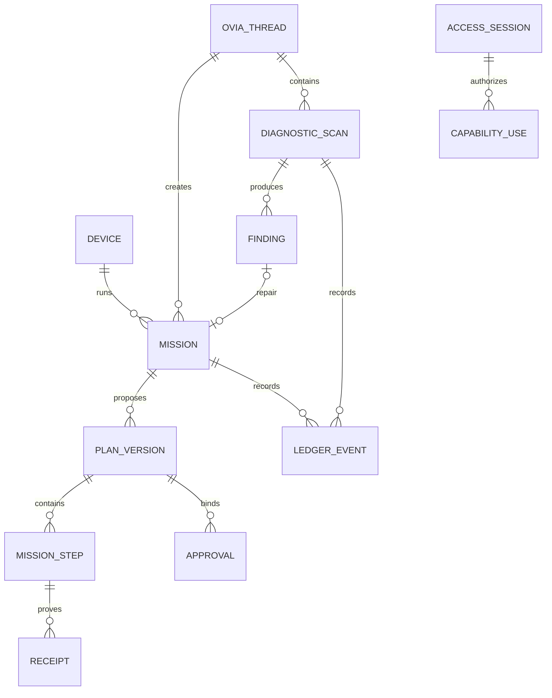

# RAIMOSA Data Model

**Status:** MVP contract baseline  
**Date:** July 20, 2026  
**Persistence model:** Local-first execution, selective cloud synchronization

## Data principles

- Local SQLite is authoritative for desktop missions, access sessions, steps, receipts, diagnostics, emergency stop, and outbox state.
- Cloud Postgres is authoritative for accounts, organizations, enrollment, organization policy, approval transport, notification routing, and synchronized summaries.
- Raw local paths, filenames, file content, screenshots, process arguments, secrets, and full logs are not synchronized by default.
- Immutable facts are appended. Mutable projections are rebuilt from facts and can be repaired.
- IDs are UUIDv7 or another time-sortable, cryptographically random identifier.
- All timestamps are UTC ISO 8601 with millisecond precision; UI converts to local time.
- User-visible changes record actor, device, source, reason, and correlation ID.
- Deletion and retention policies distinguish operational records, evidence artifacts, and account data.

## Core domain relationships

## Local SQLite tables

### `local_devices`

One row for the installed desktop identity.

| Column | Type | Notes |
|---|---|---|
| `id` | text PK | Stable device UUID |
| `display_name` | text | User-editable |
| `platform` | text | macOS, Windows, or Linux |
| `app_version` | text | Signed application version |
| `public_key` | blob | Public device identity key |
| `enrollment_state` | text | local_only, pending, enrolled, revoked |
| `policy_version` | text | Last locally accepted policy |
| `created_at`, `updated_at` | text | UTC timestamps |

Private identity material is referenced by key alias and stored in the operating-system keychain or Stronghold, never in SQLite.

### `ovia_threads`

| Column | Type | Notes |
|---|---|---|
| `id` | text PK | Thread ID |
| `title` | text | User-visible title |
| `active_mode` | text | ask, operate, scan_debug |
| `linked_mission_id` | text nullable | Current mission context |
| `created_at`, `updated_at`, `archived_at` | text | Lifecycle |

### `ovia_messages`

| Column | Type | Notes |
|---|---|---|
| `id` | text PK | Message ID |
| `thread_id` | text FK | Parent thread |
| `role` | text | user, ovia, system_event |
| `message_type` | text | answer, proposal, approval_needed, progress, finding, verified_result, error |
| `content_json` | text | Versioned structured blocks, not executable input |
| `provider_ref` | text nullable | Redacted diagnostic reference |
| `created_at` | text | UTC timestamp |

### `missions`

| Column | Type | Notes |
|---|---|---|
| `id` | text PK | Mission ID |
| `thread_id` | text nullable | Originating OVIA AI thread |
| `title` | text | User-visible outcome |
| `intent` | text | Normalized outcome statement |
| `state` | text | State machine from Information Architecture |
| `active_plan_version_id` | text nullable | Current plan |
| `risk_class` | integer | 0 to 3 |
| `created_by` | text | Actor reference |
| `created_at`, `updated_at`, `completed_at` | text | Lifecycle |

### `plan_versions`

Plans are immutable after they enter Awaiting approval.

| Column | Type | Notes |
|---|---|---|
| `id` | text PK | Plan version ID |
| `mission_id` | text FK | Mission |
| `version` | integer | Monotonic per mission |
| `schema_version` | integer | Plan contract version |
| `intent_json` | text | Canonical intent |
| `scope_json` | text | Exact normalized targets |
| `authority_json` | text | Requested capabilities |
| `postconditions_json` | text | Independent checks |
| `canonical_hash` | text | SHA-256 over canonical plan |
| `status` | text | draft, frozen, superseded, rejected |
| `created_at`, `frozen_at` | text | Lifecycle |

### `mission_steps`

| Column | Type | Notes |
|---|---|---|
| `id` | text PK | Step ID |
| `plan_version_id` | text FK | Immutable parent plan |
| `ordinal` | integer | Execution order |
| `step_kind` | text | Registered adapter operation |
| `input_json` | text | Typed, normalized input |
| `preconditions_json` | text | Target and policy checks |
| `postconditions_json` | text | Verification checks |
| `risk_class` | integer | 0 to 3 |
| `reversibility` | text | reversible, compensatable, irreversible |
| `state` | text | pending, running, succeeded, failed, cancelled, unknown |
| `idempotency_key` | text unique | Prevents replay |
| `started_at`, `finished_at` | text nullable | Execution times |

### `capability_grants`

| Column | Type | Notes |
|---|---|---|
| `id` | text PK | Grant ID |
| `principal` | text | user, ovia, workflow, adapter |
| `capability` | text | Namespaced operation |
| `scope_json` | text | Paths, app IDs, resource IDs, limits |
| `source` | text | onboarding, mission, policy, access_session |
| `source_ref` | text | Origin record |
| `issued_at`, `expires_at` | text | Duration |
| `paused_at`, `revoked_at` | text nullable | Local enforcement |
| `policy_version` | text | Evaluated policy |

### `access_sessions`

One unified OVIA AI access session model.

| Column | Type | Notes |
|---|---|---|
| `id` | text PK | Session ID |
| `level` | text | advice_only, read_only_scan, scoped, all_access |
| `principal` | text | Must be `ovia` for OVIA AI sessions |
| `user_id` | text | Authenticated issuer |
| `device_id` | text | One local device |
| `capability_families_json` | text | Included capability groups |
| `excluded_actions_json` | text | Always-step-up or denied actions |
| `policy_version` | text | Policy at issue |
| `issued_at`, `expires_at` | text | Maximum lifetime |
| `ended_at` | text nullable | User end/expiry/revocation |
| `end_reason` | text nullable | expired, user_ended, narrowed, stop, lock, revoked |

Changing OVIA AI mode does not create or modify an access session. Scan & Debug starts with a read-only scan session unless a user has visibly chosen a broader current session.

### `approvals`

| Column | Type | Notes |
|---|---|---|
| `id` | text PK | Approval ID |
| `mission_id` | text FK | Mission |
| `plan_version_id` | text FK | Frozen plan |
| `plan_hash` | text | Must match local canonical hash |
| `device_id` | text | Target device |
| `principal_id` | text | Approving user |
| `decision` | text | pending, approved, rejected, expired, consumed, invalidated |
| `risk_summary_json` | text | What was displayed |
| `nonce` | text unique | Replay prevention |
| `issued_at`, `expires_at`, `decided_at`, `consumed_at` | text nullable | Lifecycle |
| `signature_ref` | text nullable | Local/cloud authenticity evidence |

Approvals are single-use. Plan hash, target set, relevant file identity, device, expiry, policy version, and emergency-stop state are revalidated before consumption.

### `diagnostic_scans`

| Column | Type | Notes |
|---|---|---|
| `id` | text PK | Scan ID |
| `thread_id` | text FK | Same OVIA AI thread |
| `scan_kind` | text | quick, full, subsystem, verify_fix |
| `subsystem` | text nullable | Selected target |
| `check_manifest_version` | text | Versioned check set |
| `authority_level` | text | Normally read_only_scan |
| `state` | text | proposed, running, completed, completed_with_warning, failed, cancelled |
| `redaction_policy_version` | text | Applied policy |
| `started_at`, `finished_at` | text nullable | Lifecycle |

### `diagnostic_findings`

| Column | Type | Notes |
|---|---|---|
| `id` | text PK | Finding ID |
| `scan_id` | text FK | Source scan |
| `check_id`, `check_version` | text | Stable check identity |
| `status` | text | confirmed, suspected, unable_to_verify, resolved, accepted_risk |
| `severity` | text | critical, high, medium, low, informational |
| `confidence` | real | 0.0 to 1.0 |
| `summary` | text | Plain-language finding |
| `evidence_refs_json` | text | Redacted receipt references |
| `repair_mission_id` | text nullable | Linked repair |
| `first_seen_at`, `last_seen_at`, `resolved_at` | text nullable | Lifecycle |

### `receipts`

| Column | Type | Notes |
|---|---|---|
| `id` | text PK | Receipt ID |
| `step_id` | text nullable | Mission step |
| `check_id` | text nullable | Diagnostic check |
| `receipt_kind` | text | before_state, action_result, after_state, verification, diagnostic |
| `status` | text | observed, verified, failed, unknown |
| `evidence_json` | text | Redacted structured evidence |
| `artifact_ref` | text nullable | Encrypted local/cloud artifact |
| `captured_at` | text | UTC timestamp |

### `ledger_events`

Append-only API; no update or delete path in application code.

| Column | Type | Notes |
|---|---|---|
| `sequence` | integer PK | Monotonic local sequence |
| `id` | text unique | Event ID |
| `aggregate_type`, `aggregate_id` | text | Mission, access session, scan, device, policy |
| `event_type` | text | Versioned event name |
| `actor_json` | text | User/device/OVIA AI/workflow identity |
| `payload_json` | text | Canonical redacted payload |
| `correlation_id`, `causation_id` | text nullable | Trace relationships |
| `previous_hash` | text | Prior chain hash |
| `event_hash` | text | SHA-256 over canonical event envelope |
| `created_at` | text | UTC timestamp |

This chain is tamper-evident, not tamper-proof. Checkpoints can be anchored to the cloud when online.

### `sync_outbox` and `sync_cursors`

The outbox stores encrypted, redacted control-plane envelopes with idempotency keys. Acknowledgement changes sync metadata only and never replays a local action.

## Cloud Postgres tables

### Identity and organization

- `user_profiles`
- `organizations`
- `organization_members`
- `devices`
- `device_enrollments`
- `policy_versions`

### Synchronized operations

- `mission_summaries`
- `plan_manifests`
- `approval_requests`
- `approval_decisions`
- `diagnostic_scan_summaries`
- `finding_summaries`
- `ledger_checkpoints`
- `artifact_metadata`
- `notification_endpoints`
- `integration_connections`

Cloud tables carry `organization_id` and enforce RLS. Client identities never set organization membership or policy columns directly. Service-role operations are restricted to the trusted API/worker.

## Synchronization classification

| Data class | Default | Notes |
|---|---|---|
| Mission title/state/risk | Sync | Required for companion and continuity |
| Frozen plan summary/hash | Sync | Redacted targets; exact local plan stays local unless enabled |
| Approval request/decision | Sync | Signed, expiring, single-use |
| Access session details | Summary only | No transferable authority token |
| Diagnostic finding summary | Opt-in sync | Evidence remains local by default |
| Raw logs and local paths | Local only | Explicit diagnostic sharing required |
| File content/screenshots | Local only | Separate, purpose-bound consent required |
| Secrets/tokens/private keys | Never sync through product records | Secret stores only |
| Ledger checkpoint | Sync | Hash and sequence, not necessarily payload |

## Retention baseline

- Access sessions: retain event history; erase nonessential transient context after 30 days by default.
- Approval evidence and mission ledger: user-controlled retention with an enterprise policy floor.
- Raw diagnostic artifacts: local, short-lived, default seven days unless attached to a retained finding.
- Provider request/response diagnostic payloads: store only when necessary and redacted; default off in production clients.
- Account deletion: revoke devices first, then follow a documented export and deletion job with legal/enterprise exceptions disclosed.
