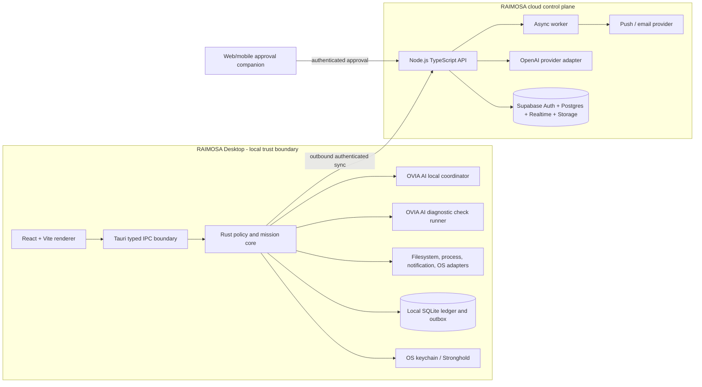

# RAIMOSA System Architecture

**Status:** MVP architecture baseline  
**Date:** July 20, 2026  
**Primary property:** Local authority, cloud coordination

## Architecture principles

1. **The model proposes; deterministic code decides and acts.**
2. **Local authority is authoritative for local action.** Cloud availability cannot create or preserve permission.
3. **Every executable operation is typed.** There is no arbitrary command string interface.
4. **Observation and action are different capabilities.** Read access never implies write access.
5. **Approval is bound to an immutable plan version.** Material changes invalidate prior approval.
6. **Receipts prove post-conditions, not intent.** `Requested` or `started` is never reported as completed.
7. **One OVIA AI, explicit modes.** Ask, Operate, and Scan & Debug share context while every mode and authority transition is explicit and logged.
8. **Offline failure is safe.** Revocation, expiry, emergency stop, and local policy evaluation work without the cloud.
9. **Collect the minimum.** Raw file content, secrets, screenshots, and full local paths stay local by default.

## System view

The desktop does not expose a general inbound remote-control socket. It initiates authenticated outbound communication and re-validates every cloud approval against local state before use.

## Desktop layers

### Renderer

Responsibilities:

- Mission Ledger, one OVIA AI chat box, Permissions, Workflows, Devices, and Settings UI;
- local presentation state;
- accessible keyboard and screen-reader behavior;
- optimistic UI only where the state can be clearly labelled as pending.

Prohibited:

- secrets;
- provider API keys;
- direct database writes;
- direct filesystem, process, shell, updater, or keychain access;
- constructing an execution command from free-form model text.

### Tauri IPC boundary

Each command has:

- a stable command name;
- an input and output schema;
- maximum payload size;
- required principal and capability;
- allowed window/webview;
- timeout and cancellation behavior;
- structured error codes;
- audit classification.

The boundary rejects unknown fields, absolute-path mismatches, stale plan versions, expired sessions, invalid caller windows, and calls not allowed by the compiled capability set.

### Rust policy and mission core

Modules:

- `identity` — local device and signed session identity;
- `missions` — mission and plan state machines;
- `policy` — capability, scope, risk, approval, expiry, and revocation decisions;
- `executor` — bounded step dispatch and cancellation;
- `verification` — post-condition checks and receipt creation;
- `ledger` — append-only event API and tamper-evident hash chain;
- `sync` — encrypted outbox and cursor management;
- `redaction` — path, secret, and evidence minimization;
- `updates` — signed release checks and installation state;
- `emergency_stop` — local stop latch and recovery inventory.

### Adapters

MVP adapters:

- read-only folder observer;
- file metadata reader;
- reversible move/rename into an approved destination;
- application/process status observer;
- native notification emitter.

Later adapters:

- Apple Accessibility (`AXUIElement`);
- Windows UI Automation;
- Linux AT-SPI;
- application-specific APIs;
- opt-in MCP connectors.

Prefer structured application, filesystem, and process APIs before UI automation. Computer-use and coordinate-driven control are outside the MVP.

## OVIA AI architecture

### Shared provider-neutral pipeline

1. The user message or scan request is classified locally.
2. A context collector selects only policy-permitted evidence.
3. Secrets and sensitive path segments are redacted.
4. The provider adapter requests a typed answer, plan draft, or finding explanation.
5. The response is schema-validated and treated as untrusted input.
6. Deterministic policy evaluates any requested observation or action.
7. An actionable plan enters the Mission Ledger and approval flow.
8. The executor runs only registered step kinds and captures receipts.
9. Verification checks post-conditions independently from model claims.

### One OVIA AI principal with explicit modes

OVIA AI can converse, retrieve permitted ledger context, propose missions, invoke versioned diagnostic checks, execute approved repairs, and verify outcomes. Its visible mode is `Ask`, `Operate`, or `Scan & Debug`.

Mode does not create authority. Ask defaults to advice only; Scan & Debug defaults to read-only diagnostic capabilities; Operate uses the current scoped or All Access session. A diagnostic check declares inputs, sensitivity, timeout, output schema, and evidence redaction. When a repair is needed, OVIA AI creates a Draft repair mission in the same thread and the mission engine evaluates the current access session plus any required step-up approval.

## Cloud control plane

### API service

A Node.js TypeScript service deployed on Railway provides:

- authentication exchange and device enrollment;
- organization and device policy distribution;
- mission summary and ledger synchronization;
- approval request and decision transport;
- OVIA AI provider requests that require server-managed credentials;
- integration webhooks;
- notification fan-out.

The API does not directly execute local desktop steps. Railway private networking isolates the API and workers; health checks and restart policy support operations. Provider secrets live in deployment variables, not source or clients.

### Supabase

Use Supabase for Auth, Postgres, private Realtime Broadcast channels, and encrypted artifact storage where explicitly enabled. Row Level Security is required on all exposed tables. The service role key exists only in trusted server infrastructure and never in desktop, web, or mobile clients.

The local SQLite database remains the source of truth for immediate local execution state. Supabase stores synchronized control-plane records and redacted evidence metadata.

### OpenAI provider adapter

Use the Responses API and/or Agents SDK behind a RAIMOSA interface for typed planning, explanations, and tool-selection proposals. Tool guardrails and schema validation supplement but do not replace RAIMOSA policy.

OpenAI computer use is excluded from the MVP. MCP servers are opt-in integrations, assigned explicit capabilities, and never receive ambient All Access.

## Companion approval surface

The initial companion is a responsive Next.js web application or installable PWA. It supports:

- authenticated approval review;
- device, mission, plan version, risk, scope, affected target, and expiry display;
- approve or reject;
- sensitive-detail re-authentication;
- notification preferences.

It does not provide general file browsing, arbitrary chat-to-execution, or full desktop remote control.

## Deployment topology

- Desktop: signed Tauri application and signed update artifacts.
- Web companion: independently deployed frontend.
- API and worker: separate Railway services on private networking.
- Database/Auth/Realtime/Storage: Supabase project with environment isolation and RLS.
- Development, staging, and production use separate identities, databases, secrets, update channels, and provider projects.

## Reliability model

- Local actions are serialized per overlapping target scope.
- Every operation has an idempotency key and deterministic receipt reference.
- The outbox retries cloud sync without replaying local action.
- Cloud approval consumption is single-use and locally revalidated.
- Long-running work supports heartbeat, cancellation request, and unknown-state recovery.
- Emergency stop blocks new steps before attempting cancellation of current steps.
- Crash recovery reconstructs state from the ledger and adapter receipts rather than UI state.

## Explicit MVP exclusions

- unrestricted shell or terminal execution;
- hidden or continuous screen recording;
- arbitrary coordinate-based computer control;
- autonomous purchases, money movement, publication, or credential changes;
- self-modifying policy;
- silent workflow learning;
- permanent All Access;
- unapproved automatic repair from Scan & Debug mode;
- claims of tamper-proof or formally verified security.
